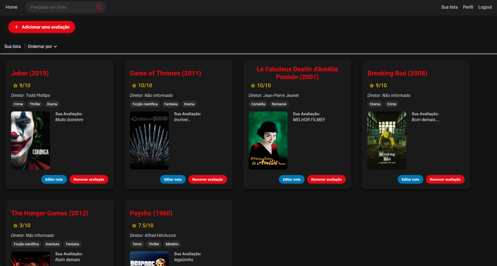

    
## <a href="https://moviemeter-c5b54.web.app" taget="_blank">Acessar o site</a>

# Visão Geral

Movie Meter é um site em que você pode descobrir, avaliar, compartilhar suas opiniões sobre filmes e séries e muito mais!. Desenvolvi com ASP.NET Core, Entity Framework, SQL Server e Angular.

## Tecnologias
* **Frontend:** Angular
* **Backend:** ASP.NET Core
* **Banco de dados:** SQL Server
* **Autenticação:** JWT

## Funcionalidades Principais

1. **Autenticação de Usuários**
   - Sistema de registro e login utilizando JWT

2. **Perfis de Usuário Personalizáveis**
   - Página única de perfil para cada usuário
   - Upload de foto de perfil
   - Edição de biografia
   - Seleção de filmes/séries favoritos

4. **Catálogo de Filmes e Séries**
   - Busca por qualquer filme/série
   - Páginas individuais para cada título

5. **Sistema de Avaliação e Resenhas**
   - Usuários podem avaliar e escrever resenhas
   - Funcionalidade de curtidas em resenhas de outros usuários

6. **Lista Pessoal de Títulos**
   - Cada usuário mantém uma lista de títulos avaliados
   - Sistema de ordenação da lista

7. **Feed de Atividades**
   - Exibição de atividades recentes dos usuários

8. **Página Inicial Dinâmica**
   - Apresentação de filmes e séries populares

## Como Utilizar

1. Crie uma conta
2. Configure seu perfil do jeito que gostar
3. Avalie e resenhe seus títulos favoritos
4. Interaja com avaliações de outros usuários

## Como rodar
1. **Clone o repositório:** `git clone https://github.com/Gabriel-sy/Movie-Meter.git`
2. **Instale as dependências:** `npm install`
3. **Execute o projeto:** `dotnet run`
4. **Faça o registro:** `localhost:4200/register`

## Desenvolvimento

Fiz esse projeto com o objetivo principal de mostrar e melhorar minhas habilidades em ASP.NET Core e Angular, no processo, eu aprendi muitas coisas, batendo a cabeça para resolver os problemas que surgiam no desenvolvimento, o que foi muito bom.

## TODO
- Colocar o site no ar usando Azure
